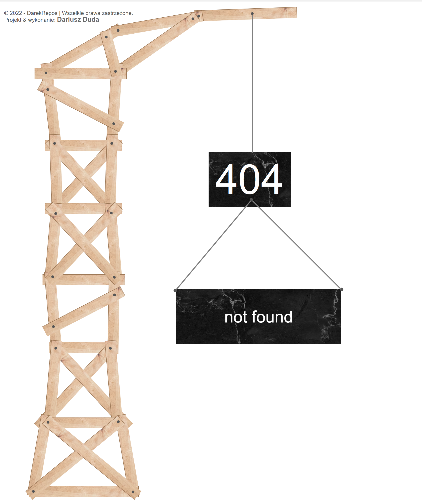

# 🔥Custom 404 Page Repository

Welcome to the repository for our custom 404 page! 🚀

## 💡About

In this repository, you'll find the code and assets for our custom 404 error page. We believe in providing a user-friendly and memorable experience even when things go wrong. That's why we've created this custom 404 page to help users navigate back to the right path when they encounter a page that doesn't exist.

## 📌 Features

- A user-friendly and engaging 404 page.
- Custom graphics and messages to guide users.
- Easy integration with your web application.

## 💫 How to Use

1. Simply integrate our custom 404 page with your web application.
2. Customize the page to match your brand's look and feel.
3. Provide users with a helpful and clear path to navigate your website effectively.

Feel free to explore the code and assets in this repository, and don't hesitate to reach out if you have any questions or need assistance with the integration.

## 💟 Preview of the Webpage

For a live demo, visit 

We hope our custom 404 page enhances your users' experience on your website. If you find it useful, please give us a star ⭐!

## 🏷️ Picture credit

- [Tile texture photo created by tirachard - www.freepik.com](https://www.freepik.com/photos/tile-texture)
- [Pine wood photo created by yingyang - www.freepik.com](https://www.freepik.com/photos/pine-wood)
